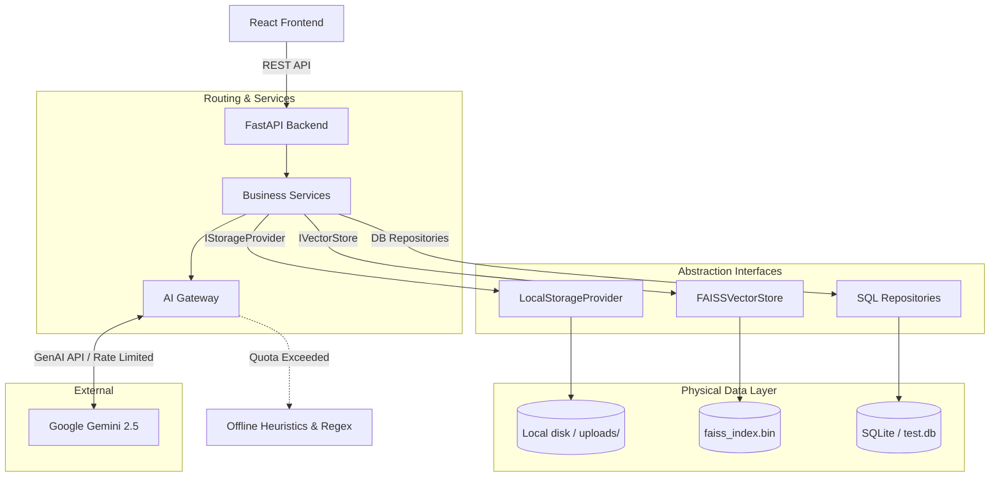

# 📜 ClauseIQ: Enterprise Contract Intelligence Platform

ClauseIQ is an advanced, AI-powered document analysis and contract intelligence platform. It leverages Retrieval-Augmented Generation (RAG), semantic vector search, and hybrid heuristic fallbacks to automatically analyze legal documents, extract clauses, generate compliance checklists, identify risks, and compare document versions with blazing speed and minimal API costs.

---

## 🚀 Key Features

*   **Intelligent Document Processing:** Upload PDFs to automatically parse, chunk, and semantically index the content using FAISS and Google Generative AI embeddings.
*   **Deep Legal Insights:**
    *   **Summarization:** Generates structured executive summaries and extracts key obligations.
    *   **Compliance Checklists:** Automatically evaluates documents against standard business requirements (e.g., NDA, Indemnification).
    *   **Risk Analysis:** Flags High, Medium, and Low risks with citations back to the source text.
*   **Clause Explorer:** Browse all extracted clauses of a contract grouped, identified, and mapped back to their source page numbers using an overlap matching heuristic.
*   **Document Versioning & Comparison Engine:** Upload a newer version of a contract to run a `rapidfuzz`-powered differential analysis. The system intelligently highlights added, removed, unchanged, and modified clauses, using Gemini only to analyze the semantic compliance impact of modifications.
*   **Context-Aware RAG Chat (Multi-Stage Retrieval Pipeline):** Ask questions about your document and get answers cited directly to the exact page and section. Instead of a basic single-pass vector search, ClauseIQ implements a production-grade multi-stage pipeline:
    *   *Candidate Expansion*: Queries FAISS for `top_k * 2` candidates to maximize recall.
    *   *Metadata Scoping*: Restricts vectors strictly to the active `document_id` to prevent cross-document leakage.
    *   *Hybrid Reranking*: Re-scores chunks using a weighted combination of semantic similarity ($0.7$) and Jaccard token overlap ($0.3$) to prioritize exact keyword matches (e.g. key figures, dates, negations).
    *   *Context Synthesis*: Feeds the top 5 reranked results to Gemini for generation.
*   **Premium Glassmorphism UI:** Responsive dashboard design utilizing a modern glassmorphism aesthetic built using **React**, **GSAP**, **Anime.js**, and **Framer Motion**.
*   **Cost Optimization & Offline Resilience:** 
    *   **Persistent Caching:** Responses are snapshotted in SQLite; repeated analysis costs $0 and runs instantly.
    *   **Graceful Fallbacks:** If the Gemini API rate limit is exceeded, the system automatically falls back to offline Regex parsing and heuristic rules so you are never left blocked.
*   **Multi-Format Export Engine:** Instantly export comprehensive analysis reports to **PDF**, **DOCX**, or **JSON**.
*   **Observability Dashboard:** Real-time metrics UI tracking API usage, cache hits, misses, and overall cost savings.

---

## 🛠️ Engineering Challenges Solved

### 1. Preventing Cross-Document Retrieval Leakage
*   **Challenge:** Vector databases can return semantically similar chunks from unrelated documents.
*   **Solution:** Implemented metadata-scoped retrieval using `document_id` filtering during FAISS candidate selection to guarantee that chat responses only use chunks belonging to the active document.

### 2. Operating During AI Outages
*   **Challenge:** Gemini rate limits and service outages can make AI-powered systems unusable.
*   **Solution:** Built a multi-layer fallback architecture that replaces AI functionality with local heuristic processing for summaries, compliance analysis, risk detection, and clause extraction.

### 3. Accurate Contract Version Comparison
*   **Challenge:** Embedding similarity often misses legally significant changes involving numbers, dates, or negations.
*   **Solution:** Implemented a RapidFuzz-powered comparison engine with semantic impact analysis triggered only for modified clauses, reducing API costs while improving precision.

---

## 🏗️ System Architecture

ClauseIQ follows a highly decoupled, abstraction-centric architecture designed for database and storage engine independence:



---

## 🛠️ Technology Stack

**Frontend:**
*   React 18 + Vite
*   Vanilla CSS (Glassmorphism UI)
*   **GSAP** (UI entry animations)
*   **Anime.js** (Particle transitions)
*   **Framer Motion** (Layout transitions)
*   Axios for API communication

**Backend:**
*   Python 3.12 + FastAPI
*   SQLAlchemy + SQLite (Decoupled via Repository Pattern & Interfaces)
*   FAISS (Decoupled via IVectorStore Interface)
*   Disk File Storage (Decoupled via IStorageProvider Interface)
*   `google-genai` (Official Google Generative AI SDK)
*   `rapidfuzz` (Blazing fast string matching for version diffs)
*   `python-docx` & `reportlab` (Export Generation)

---

## ⚙️ Installation & Setup

### Prerequisites
*   Node.js (v18+)
*   Python (3.10+)
*   A Google Gemini API Key

### 1. Clone the Repository
```bash
git clone https://github.com/yourusername/clauseiq.git
cd clauseiq
```

### 2. Backend Setup
Navigate to the backend directory and install the dependencies:
```bash
cd backend
pip install -r requirements.txt
```

Create a `.env` file in the `backend/` directory:
```env
GEMINI_API_KEY=your_gemini_api_key_here
PROJECT_NAME="ClauseIQ"
```

### 3. Frontend Setup
Navigate to the frontend directory and install dependencies:
```bash
cd ../frontend
npm install
```

---

## 🏃‍♂️ Running the Application

You need two terminal windows to run both the backend and frontend simultaneously.

**Terminal 1: Start the Backend (FastAPI)**
```bash
cd backend
uvicorn app.main:app --reload
```
*The backend will be available at `http://localhost:8000`*

**Terminal 2: Start the Frontend (Vite)**
```bash
cd frontend
npm run dev
```
*The frontend will be available at `http://localhost:5173`*

---

## 📂 Folder Structure

```text
clauseiq/
├── backend/
│   ├── app/
│   │   ├── api/routes/         # FastAPI Route Controllers (chat, documents, export, comparison, checklist, etc.)
│   │   ├── core/               # Configuration and Exception handling
│   │   ├── db/                 # SQLite Session configurations
│   │   ├── models/             # SQLAlchemy schemas (Document, Chunk, Clause, AnalysisSnapshot, Metrics)
│   │   ├── repositories/       # Abstraction Layer (Document, Chunk, Clause, Snapshot, Metrics Repositories & Interfaces)
│   │   ├── schemas/            # Pydantic validation schemas
│   │   ├── services/           # Core Business Logic (AI, RAG, Comparison, Exports)
│   │   ├── storage/            # File Storage Provider Abstraction (LocalStorageProvider & IStorageProvider)
│   │   └── vector_store/       # Vector Database Abstraction (FAISSVectorStore & IVectorStore)
│   ├── exports/                # Generated PDF and DOCX reports
│   └── test.db                 # Local SQLite Database
│   └── uploads/                # Local PDF Storage Storage Directory
└── frontend/
    ├── src/
    │   ├── components/         # React Views & Components (Dashboard, Observability, ComparisonView, UI elements)
    │   ├── App.jsx             # Main Application Container & Route Transitions
    │   └── index.css           # Global Styles & Theme Design Tokens
    └── package.json
```

---

## 🛡️ License
This project is proprietary and built for enterprise deployment. All rights reserved.
