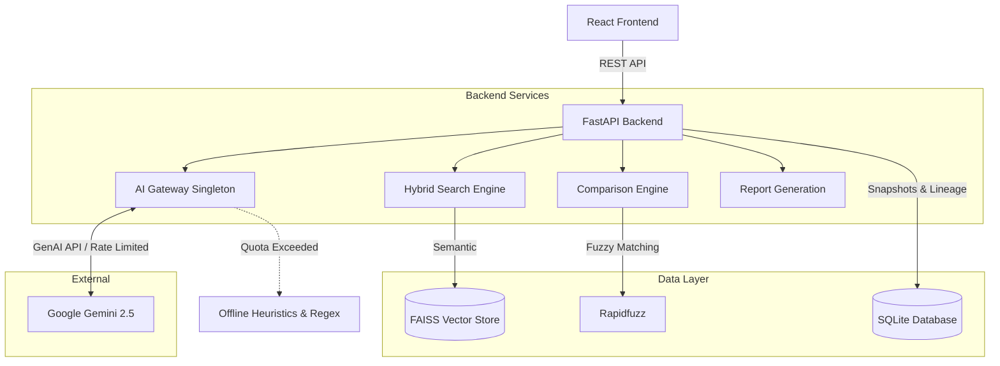

# 📜 ClauseIQ: Enterprise Contract Intelligence Platform

ClauseIQ is an advanced, AI-powered document analysis and contract intelligence platform. It leverages Retrieval-Augmented Generation (RAG), semantic vector search, and hybrid heuristic fallbacks to automatically analyze legal documents, extract clauses, generate compliance checklists, identify risks, and compare document versions with blazing speed and minimal API costs.

---

## 🚀 Key Features

*   **Intelligent Document Processing:** Upload PDFs to automatically parse, chunk, and semantically index the content using FAISS and Google Generative AI embeddings.
*   **Deep Legal Insights:**
    *   **Summarization:** Generates structured executive summaries and extracts key obligations.
    *   **Compliance Checklists:** Automatically evaluates documents against standard business requirements (e.g., NDA, Indemnification).
    *   **Risk Analysis:** Flags High, Medium, and Low risks with citations back to the source text.
*   **Document Versioning & Comparison Engine:** Upload a newer version of a contract to run a `rapidfuzz`-powered differential analysis. The system intelligently highlights added, removed, unchanged, and modified clauses, using Gemini only to analyze the semantic compliance impact of modifications.
*   **Context-Aware RAG Chat:** Ask questions about your document and get answers cited directly to the exact page and section using a hybrid FAISS + Keyword (BM25-style) reranking algorithm.
*   **Cost Optimization & Offline Resilience:** 
    *   **Persistent Caching:** Responses are snapshotted in SQLite; repeated analysis costs $0 and runs instantly.
    *   **Graceful Fallbacks:** If the Gemini API rate limit is exceeded, the system automatically falls back to offline Regex parsing and heuristic rules so you are never left blocked.
*   **Multi-Format Export Engine:** Instantly export comprehensive analysis reports to **PDF**, **DOCX**, or **JSON**.
*   **Observability Dashboard:** Real-time metrics UI tracking API usage, cache hits, misses, and overall cost savings.

---

## 🏗️ System Architecture



---

## 🛠️ Technology Stack

**Frontend:**
*   React 18 + Vite
*   Vanilla CSS (Clean, Professional UI)
*   Axios for API communication

**Backend:**
*   Python 3.12 + FastAPI
*   SQLAlchemy + SQLite (Persistent Storage & Caching)
*   FAISS (Vector Database)
*   `google-genai` (Official Google Generative AI SDK)
*   `rapidfuzz` (Blazing fast string matching for version diffs)
*   `python-docx` & `reportlab` (Export Generation)

---

## ⚙️ Installation & Setup

### Prerequisites
*   Node.js (v18+)
*   Python (3.10+)
*   A Google Gemini API Key

### 1. Clone the Repository
```bash
git clone https://github.com/yourusername/clauseiq.git
cd clauseiq
```

### 2. Backend Setup
Navigate to the backend directory and install the dependencies:
```bash
cd backend
pip install -r requirements.txt
```

Create a `.env` file in the `backend/` directory:
```env
GEMINI_API_KEY=your_gemini_api_key_here
PROJECT_NAME="ClauseIQ"
```

### 3. Frontend Setup
Navigate to the frontend directory and install dependencies:
```bash
cd ../frontend
npm install
```

---

## 🏃‍♂️ Running the Application

You need two terminal windows to run both the backend and frontend simultaneously.

**Terminal 1: Start the Backend (FastAPI)**
```bash
cd backend
uvicorn app.main:app --reload
```
*The backend will be available at `http://localhost:8000`*

**Terminal 2: Start the Frontend (Vite)**
```bash
cd frontend
npm run dev
```
*The frontend will be available at `http://localhost:5173`*

---

## 📂 Folder Structure

```text
clauseiq/
├── backend/
│   ├── app/
│   │   ├── api/routes/         # FastAPI Route Controllers (chat, summary, export, metrics)
│   │   ├── core/               # Configuration and Exception handling
│   │   ├── db/                 # SQLite Session configurations
│   │   ├── models/             # SQLAlchemy schemas (Document, Clause, AnalysisSnapshot, Metrics)
│   │   ├── schemas/            # Pydantic validation schemas
│   │   └── services/           # Core Business Logic (AI, RAG, Comparison, Exports)
│   ├── exports/                # Generated PDF and DOCX reports
│   └── test.db                 # Local SQLite Database
└── frontend/
    ├── src/
    │   ├── components/         # React Components (Dashboard, Observability, ComparisonView)
    │   ├── App.jsx             # Main Application Container
    │   └── index.css           # Global Styles
    └── package.json
```

---

## 🛡️ License
This project is proprietary and built for enterprise deployment. All rights reserved.
