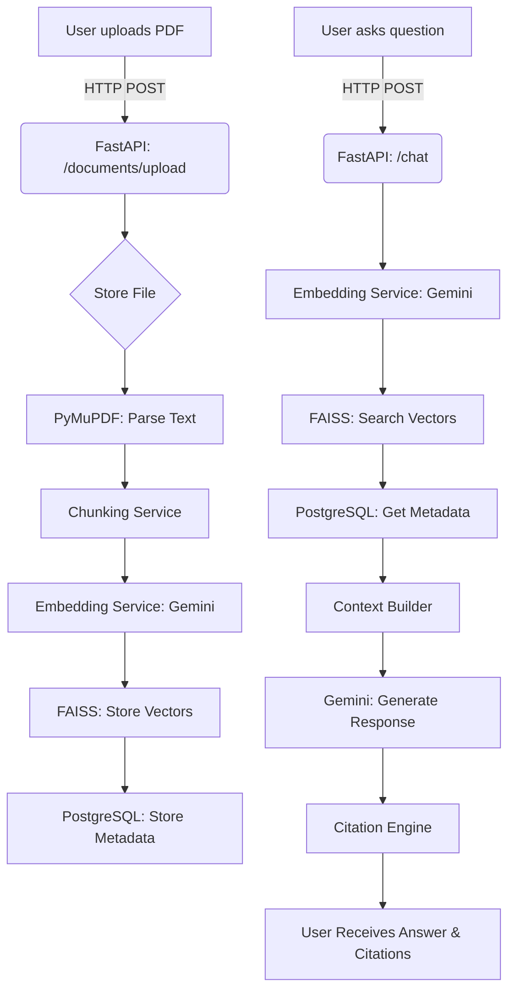

# ClauseIQ - Phase 2 Implementation Plan

This document provides a detailed technical design and implementation plan for Phase 2 of the ClauseIQ project, focusing on building the core RAG (Retrieval-Augmented Generation) system.

## 1. Complete Technical Design

The system is composed of a React frontend and a FastAPI backend. The backend handles document processing, embedding, and the entire RAG pipeline, while the frontend provides the user interface for interaction.

### Data Flow Diagram



## 2. Module Breakdown

- **Document Upload Module**: Handles file uploads, validation, and storage.
- **Document Parsing Module**: Extracts text and metadata from documents using PyMuPDF.
- **Chunking Strategy**: Splits documents into manageable, overlapping chunks for effective retrieval.
- **Embedding Pipeline**: Generates vector embeddings for text chunks using Gemini Embeddings.
- **FAISS Vector Store**: Stores and retrieves vector embeddings.
- **Retriever Design**: Implements the logic for searching and ranking relevant chunks.
- **Citation Engine**: Generates and formats citations for the retrieved context.
- **Question Answering Pipeline**: Orchestrates the retrieval and generation process to answer user queries.
- **Chat Module**: Manages conversation history and state.
- **Testing Strategy**: Defines the approach for testing and evaluating the system.

## 3. Folder Structure

```
clauseiq/
├── backend/
│   ├── app/
│   │   ├── api/
│   │   │   └── routes/
│   │   │       ├── chat.py
│   │   │       ├── documents.py
│   │   │       └── search.py
│   │   ├── core/
│   │   │   └── config.py
│   │   ├── db/
│   │   │   └── session.py
│   │   ├── models/
│   │   │   └── document.py
│   │   ├── schemas/
│   │   │   ├── chat.py
│   │   │   ├── document.py
│   │   │   └── search.py
│   │   ├── services/
│   │   │   ├── chat_service.py
│   │   │   ├── document_service.py
│   │   │   ├── embedding_service.py
│   │   │   ├── parser_service.py
│   │   │   └── search_service.py
│   │   ├── utils/
│   │   └── vector_store/
│   │       └── faiss.py
│   │   └── main.py
│   ├── tests/
│   └── requirements.txt
├── frontend/
│   ├── src/
│   │   ├── components/
│   │   │   ├── Chat.jsx
│   │   │   └── DocumentUpload.jsx
│   │   ├── App.jsx
│   │   └── main.jsx
│   └── package.json
└── docs/
    └── PHASE_2_PLAN.md
```

## 4. API Specifications

### Document API

- `POST /api/v1/documents/upload`: Upload a document.
  - **Request**: `multipart/form-data` with a file.
  - **Response**: `Document` schema.
- `GET /api/v1/documents/{document_id}`: Get document details.
- `GET /api/v1/documents/`: Get all documents.

### Search API

- `POST /api/v1/search`: Perform a semantic search.
  - **Request**: `SearchQuery` schema.
  - **Response**: `SearchResult` schema.

### Chat API

- `POST /api/v1/chat`: Chat with the RAG system.
  - **Request**: `ChatQuery` schema.
  - **Response**: `ChatResponse` schema.

## 5. Metadata Schemas

### Document Schema
```python
class Document(BaseModel):
    id: str
    filename: str
    content_hash: str
```

### Chunk Schema
```python
class Chunk(BaseModel):
    id: str
    document_id: str
    page: int
    section: Optional[str]
    content: str
```

### Citation Schema
```python
class Citation(BaseModel):
    document_name: str
    page_number: int
    section: Optional[str]
```

## 6. RAG Workflow Diagrams

(See Data Flow Diagram in Section 1)

## 7. LangChain Architecture

While the initial implementation uses a direct implementation of the RAG pipeline, LangChain can be integrated to abstract and streamline the process.

```python
from langchain.chains import RetrievalQA
from langchain_community.vectorstores import FAISS
from langchain_google_genai import GoogleGenerativeAI, GoogleGenerativeAIEmbeddings

# 1. Setup Embeddings
embeddings = GoogleGenerativeAIEmbeddings(model="models/embedding-001")

# 2. Setup VectorStore
vector_store = FAISS.from_texts(texts, embeddings)

# 3. Setup Retriever
retriever = vector_store.as_retriever()

# 4. Setup LLM
llm = GoogleGenerativeAI(model="gemini-2.5-flash")

# 5. Create Chain
qa_chain = RetrievalQA.from_chain_type(
    llm=llm,
    chain_type="stuff",
    retriever=retriever,
    return_source_documents=True
)

# 6. Run Query
query = "What are the payment terms?"
result = qa_chain({"query": query})
```

This simplifies the orchestration logic in the `ChatService`.

## 8. Testing Plan

- **Unit Tests**: Test individual functions and services (e.g., `embed_single`, `parse_document`).
- **Integration Tests**: Test the interaction between services (e.g., upload -> parse -> embed -> store).
- **E2E Tests**: Test the full user flow from the frontend.
- **Evaluation Metrics**:
  - **Retrieval**: `Precision`, `Recall`, `MRR` (Mean Reciprocal Rank).
  - **Citation Accuracy**: Percentage of citations that correctly point to the source.
  - **Response Quality**: `Faithfulness` (how well the response is grounded in the source), `Relevance`. Use LLM-as-a-judge for evaluation.

## 9. Development Checklist

- [x] Set up project structure.
- [x] Implement Document Upload Module.
- [x] Implement Document Parsing Module.
- [x] Define Chunking Strategy.
- [x] Implement Embedding Pipeline.
- [x] Set up FAISS Vector Store.
- [x] Implement Retriever.
- [x] Implement Citation Engine.
- [x] Implement Question Answering Pipeline.
- [ ] Implement Chat Module with conversation history.
- [ ] Write unit and integration tests.
- [ ] Build frontend components.
- [ ] Conduct E2E testing and evaluation.
- [ ] Document code and APIs.
